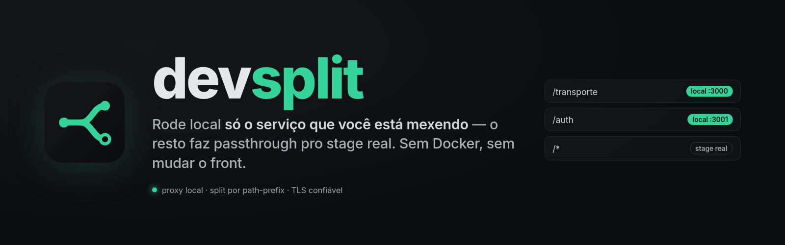
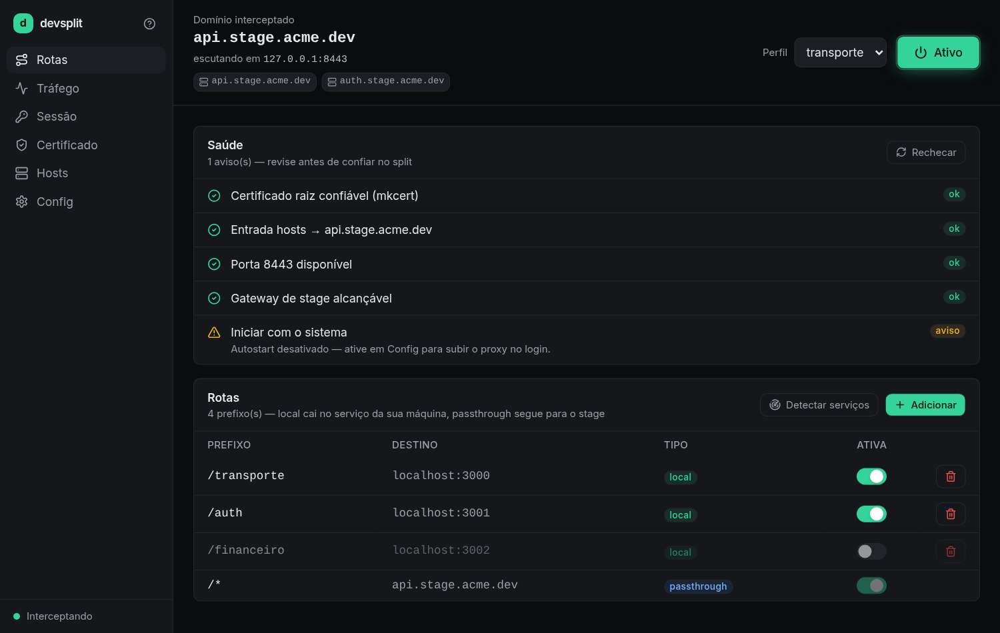
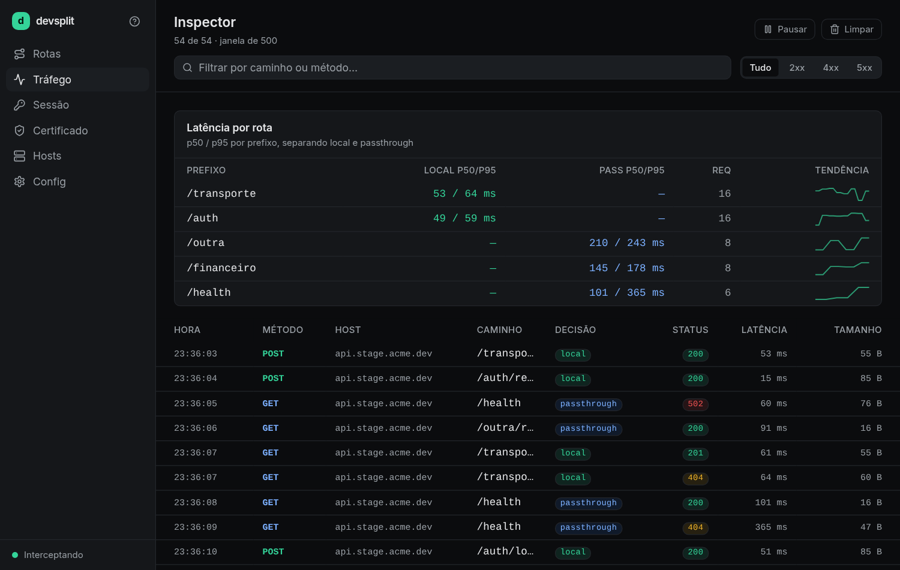
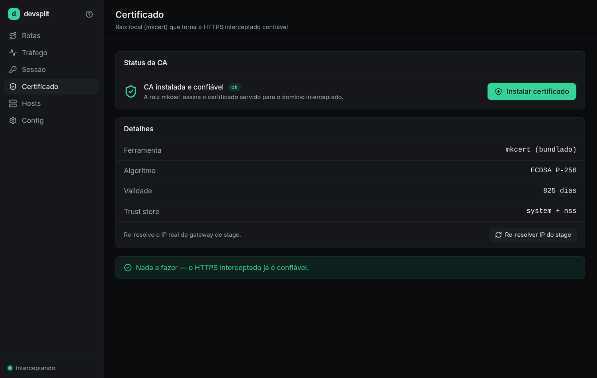

<p align="center">
  
</p>

<p align="center">
  <b>devsplit</b> — proxy de desenvolvimento que <b>divide o tráfego do seu gateway de stage</b>:
  os caminhos que você escolher rodam no seu <code>localhost</code>, o resto continua indo
  pro ambiente real. <b>Sem Docker, sem mudar o front.</b>
</p>

<p align="center">
  
  
  
  <a href="https://github.com/Matheuscara/devsplit/actions/workflows/security-scan.yml"></a>
  
  
  
</p>

<p align="center">
  <a href="#o-que-é">O que é</a> ·
  <a href="#o-problema-que-resolve">O problema</a> ·
  <a href="#a-interface">A interface</a> ·
  <a href="#como-funciona-invariantes">Como funciona</a> ·
  <a href="#rodar">Rodar</a> ·
  <a href="#status-por-plataforma">Status</a> ·
  <a href="#documentação">Docs</a>
</p>

---

## O que é

Um **app de desktop** que fica entre o seu navegador e o gateway HTTP de um ambiente de
**stage**. Ele intercepta o domínio do stage na sua máquina e faz **split por path-prefix**:

- os prefixos que você marca (`/transporte`, `/auth`, …) vão para **serviços rodando no
  seu `localhost`**;
- **todo o resto** faz **passthrough** para o stage real — com o certificado validado de
  verdade (sem `insecureSkipVerify`).

O front **não muda**: continua apontando para a URL de stage. Você liga/desliga rotas numa
interface, e o devsplit cuida do TLS local confiável, do `/etc/hosts` e do roteamento.

<p align="center">
  <br>
  <sub><i>Tela <b>Rotas</b>: domínio interceptado, perfil ativo, botão liga/desliga, painel de Saúde e a tabela de rotas (local × passthrough).</i></sub>
</p>

## O problema que resolve

> "Pra rodar 1 task eu preciso subir 10 microsserviços + RabbitMQ + observabilidade. Meu
> PC não aguenta."

Com o devsplit você roda **só o serviço que está mexendo**. O resto da malha (auth, banco,
filas, os outros microsserviços) continua sendo o **stage**, que já está de pé. Acabou o
"sobe tudo localmente pra mexer em um pedaço".

```
front (browser) ─▶ https://api.stage.acme.com     (no seu PC, resolve p/ 127.0.0.1)
                        │
                        ▼
                 devsplit  (:443, TLS local confiável)
                   ├─ /transporte, /auth ─▶ 127.0.0.1:3000 / :3001   (LOCAL)
                   └─ /*                  ─▶ IP_REAL_DO_STAGE:443      (PASSTHROUGH, cert validado)
```

## A interface

Seis telas, foco em densidade e clareza (estilo dev-tool — Linear/Raycast).

| Tela | O que faz |
|---|---|
| **Rotas** | Liga/desliga a interceptação, escolhe o perfil, edita as rotas (prefixo → porta local) e mostra o painel de **Saúde** (cert / hosts / `:443` / stage). |
| **Tráfego** | Inspector ao vivo: cada requisição com método, caminho, **decisão** (local/passthrough), status e latência; **latência p50/p95 por rota**; filtro e copy-as-curl / export HAR. |
| **Sessão** | Decodifica o JWT do header `Authorization: Bearer` visto no tráfego (claims, expiração). |
| **Certificado** | Status da CA local (`mkcert`), algoritmo, validade, trust store; botão **Instalar certificado**. |
| **Hosts** | O que o devsplit escreveu no `/etc/hosts` (bloco demarcado, reversível). |
| **Config** | O `devsplit.yaml` resolvido, perfis e autostart. |

<table>
  <tr>
    <td width="50%" valign="top">
      <br>
      <sub><i><b>Tráfego</b> — inspector ao vivo + latência por rota.</i></sub>
    </td>
    <td width="50%" valign="top">
      <br>
      <sub><i><b>Certificado</b> — CA local confiável (mkcert), validação por SNI.</i></sub>
    </td>
  </tr>
</table>

> As capturas usam dados de exemplo (modo de demonstração da UI). No app real, os mesmos
> painéis refletem o seu `devsplit.yaml` e o tráfego de verdade.

## Como funciona (invariantes)

- **Transparência:** o front aponta p/ a URL de stage; o `/etc/hosts` manda o FQDN p/
  `127.0.0.1`; o devsplit termina o TLS com um cert local **confiável** (via `mkcert`).
- **Anti-loop:** o IP real do stage é descoberto por **DNS direto** (`hickory`, nameserver
  explícito) que **ignora** o `/etc/hosts` — senão o proxy conectaria em si mesmo.
- **Passthrough seguro:** conecta no IP real e **valida** o cert remoto contra o SNI (FQDN),
  sem desabilitar verificação.
- **Hot-reload:** a tabela de rotas vive num `ArcSwap`; ligar/desligar rota não derruba
  conexões em voo (inclusive WebSocket).
- **Segurança no inspector:** headers como `cookie`/`x-api-key`/`*secret*`/`*token*` são
  **redatados**; só `authorization` fica visível (é o que o painel de Sessão decodifica).
- **1 prompt de senha por sessão** (Linux): elevação só para editar o `/etc/hosts` e
  liberar a `:443`. O app roda sem root.

## Stack

**Tauri v2** — núcleo em **Rust** (`crates/devsplit-core`: proxy `hyper`+`rustls`, TLS
`rcgen`+`mkcert`, DNS `hickory`, hosts, config) e UI em **React + Tailwind + TypeScript**
(`app/src`). App nativo único, leve. Desenho completo em
[`BLUEPRINT.md`](./BLUEPRINT.md) e em [`docs/`](./docs/).

## Rodar

### Testes do núcleo (só precisa de Rust)

```bash
cargo test -p devsplit-core              # 18 testes (inclui e2e cliente-TLS → proxy → backend)
cargo test -p devsplit-core -- --ignored # + teste de rede (DNS direto)
```

### O app (Linux — verificado)

```bash
# 1. webview nativo (Arch/CachyOS):
sudo pacman -S webkit2gtk-4.1 libsoup3        # Debian/Ubuntu: libwebkit2gtk-4.1-dev librsvg2-dev
# 2. mkcert no PATH (TLS confiável):           https://github.com/FiloSottile/mkcert
# 3. rodar (carrega o frontend embutido no binário — sem dev server):
cd app && npm install && npm run build
cd src-tauri && cargo run
```

> **Não** use `cargo tauri dev` em máquina apertada de RAM: ele sobe o Vite (dev server),
> que pode dar OOM. O `cargo run` carrega o `dist/` embutido. Detalhes em
> [`docs/getting-started.md`](./docs/getting-started.md) e
> [`docs/troubleshooting.md`](./docs/troubleshooting.md).

### Explorar a UI no navegador (dados de exemplo)

```bash
cd app && npm install && npm run dev   # http://localhost:1420 — sem backend, modo demo
```

### Configurar

Copie [`examples/devsplit.yaml`](./examples/devsplit.yaml) para a raiz do seu repo como
`devsplit.yaml` e ajuste o `upstream.host` (FQDN do stage) e os `profiles.*.routes`
(prefixos → portas locais). Referência: [`docs/10-referencia-devsplit-yaml.md`](./docs/10-referencia-devsplit-yaml.md).

## Instalar

### No seu PC (Linux, sem root)

```bash
./packaging/install-local.sh        # build (--no-bundle) + binario, icones, .desktop e config
```

Poe o binario em `~/.local/bin`, registra o `.desktop` (aparece no launcher — **Super+Espaco**) e
**copia o `devsplit.yaml` para `~/.config/dev.devsplit.app/`**. Esse seed e essencial: aberto pelo
launcher o cwd e o `$HOME` (nao o repo), entao sem a config ali o app nao acha o stage e o botao
**ligar nao faz nada**. Desinstala com `./packaging/install-local.sh --uninstall`.

Runtime: **mkcert** (confia a CA no navegador) e **polkit/pkexec** (edita `/etc/hosts` + libera a
`:443`). Em WM enxutos (niri/sway/hyprland) tenha um **agente polkit** ativo, senao o prompt de senha
nao aparece.

### Disponibilizar para baixar

Tag `v*` dispara o CI ([`build.yml`](./.github/workflows/build.yml)), que publica um release com
`.AppImage`/`.deb`/`.dmg`/`.msi`. Local, `cd app && cargo tauri build` gera o `.AppImage` (universal) e
o `.deb` em `app/src-tauri/target/release/bundle/`. O usuario escolhe pela distro:

| Distro | Instala | No launcher |
|---|---|---|
| Debian/Ubuntu/Mint | `sudo apt install ./devsplit_<ver>_amd64.deb` | sim (auto) |
| Arch/CachyOS/Manjaro | AUR via [`packaging/PKGBUILD`](./packaging/PKGBUILD) — `makepkg -si` (extrai o `.deb` do release) | sim (auto) |
| Qualquer outra | baixa o `.AppImage` + `./packaging/install-appimage.sh <arquivo>` | sim (registra) |

Todas exigem **mkcert** + **polkit** no runtime (ja declarados como deps no PKGBUILD).

## Status por plataforma

| Plataforma | Estado |
|---|---|
| **Linux** | ✅ **rodando de ponta a ponta** — app compila, abre, intercepta; núcleo 18 testes |
| **macOS** | 🟡 **implementado** (elevação via `osascript`); compila no Linux via `cfg!`, **build/runtime via CI** |
| **Windows** | 🟡 **implementado** (elevação via UAC/PowerShell); **build/runtime via CI** |

Build dos 3 SOs + release com instaladores: CI em
[`.github/workflows/build.yml`](./.github/workflows/build.yml) (`tauri-action`, matriz
`ubuntu`/`macos`/`windows`; tag `v*` → release draft com `.AppImage`/`.deb`/`.dmg`/`.msi`).
Painel completo de entregas em [`docs/STATUS.md`](./docs/STATUS.md).

## Documentação

Guia completo em [`docs/`](./docs/). Atalhos:
[`getting-started`](./docs/getting-started.md) ·
[`00-blueprint`](./docs/00-blueprint.md) ·
[`02-arquitetura`](./docs/02-arquitetura.md) ·
[`04-build-distribuicao`](./docs/04-build-distribuicao.md) ·
[`11-tls-privilegios-seguranca`](./docs/11-tls-privilegios-seguranca.md) ·
[`troubleshooting`](./docs/troubleshooting.md) ·
[`STATUS`](./docs/STATUS.md).

## Logo & design

A marca — um fluxo que se divide em **local** (preenchido) e **passthrough** (vazado) —
está em [`design/`](./design/): `icon.svg` (fonte), `logo.png`, `banner.png`, e as capturas
em `design/shots/`. Os ícones do app são gerados da marca (`cargo tauri icon design/logo.png`).
Mockup estático da UI em [`design/mockup.html`](./design/mockup.html).

## Layout

```
devsplit/
├── README.md · BLUEPRINT.md           # front-door + desenho completo
├── docs/                              # documentação (pt-BR)
├── crates/devsplit-core/              # NÚCLEO Rust (sem GUI) — compila/testa em qualquer lugar
├── app/
│   ├── src/                           # UI React (TypeScript)
│   └── src-tauri/                     # casca Tauri (Rust): comandos, tray, elevação por-SO
├── design/                            # logo, banner, ícones-fonte, capturas, mockup
├── examples/devsplit.yaml             # config de time (commitável)
└── .github/workflows/build.yml        # CI: testa + builda os 3 SOs + release
```

## Licença

Licenciado sob **MIT** ([`LICENSE-MIT`](./LICENSE-MIT)) ou **Apache-2.0**
([`LICENSE-APACHE`](./LICENSE-APACHE)), à sua escolha.

Salvo indicação em contrário, qualquer contribuição enviada por você para inclusão neste
projeto, conforme a Apache-2.0, será dual-licenciada como acima, sem termos adicionais.
