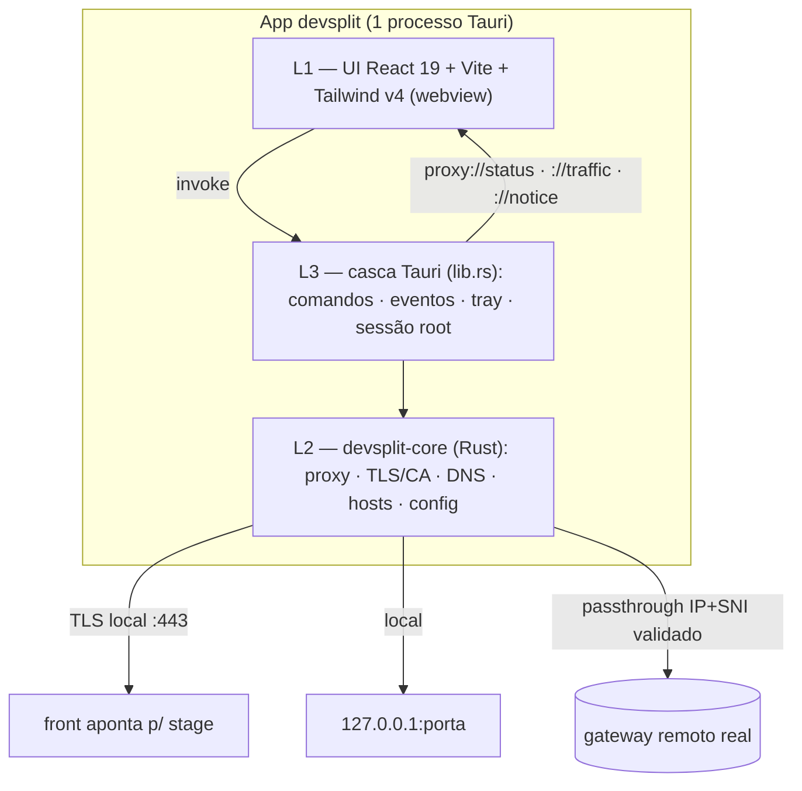

# 00 — Blueprint: devsplit (app desktop Tauri + Rust)

> Síntese executiva. Fixa a tese do produto, as decisões de stack e o estado de
> implementação. Detalhes nos documentos `01`–`12`. Documento em pt-BR, técnico, denso.
>
> **O que é:** app **desktop** (Tauri v2) que intercepta o gateway HTTP de um ambiente
> de **stage** e faz **split por path-prefix** — prefixos escolhidos (`/transporte`,
> `/auth`) vão para serviços rodando na sua máquina; o resto faz **passthrough** para o
> gateway remoto **real** (com o certificado validado de verdade). O front não muda:
> continua apontando para a URL de stage.
>
> **Stack:** núcleo em **Rust** (`crates/devsplit-core` — proxy/TLS/DNS/hosts/config),
> UI em **React 19 + Vite + Tailwind v4** (`app/`), tudo num único processo Tauri.

---

## 1. Tese do produto (em uma frase)

devsplit substitui o setup hand-rolled de **Traefik + mkcert + `/etc/hosts` + scripts
bash** por um **app cross-platform, gerenciável por uma UI, com config commitável**
reutilizável pelo time. Resolve a dor de "preciso subir 10 microsserviços + RabbitMQ +
observabilidade só pra rodar 1 task": você roda só o serviço que está mexendo e o
devsplit costura o resto, apontando o catch-all para o stage real.

### 1.1 O que o produto NÃO é (honestidade que sustenta o uso)

| Afirmação tentadora | Realidade | Onde |
|---|---|---|
| "É um proxy de debug tipo Charles/Proxyman" | **Não.** É reverse-proxy transparente por domínio, não forward-proxy de sistema. Sem PAC, sem mudar `.env`. | `01` §1, `06` |
| "Dá pra interceptar produção" | **Recusado por design.** Só **stage/qa** — o token e o banco do dev vivem no mesmo ambiente; o serviço local valida contra o mesmo issuer. | `01` §4, `11` §3 |
| "Funciona em qualquer SO hoje" | A casca de elevação implementada hoje é **Linux (pkexec/setcap/sysctl)**. macOS/Windows estão desenhados, não codados. | `04` §3, `STATUS.md` |

---

## 2. As quatro invariantes não-negociáveis

São o que torna o produto correto; toda decisão de implementação se subordina a elas.

1. **Transparência.** O front continua apontando para a URL de stage. O `/etc/hosts`
   manda o FQDN para `127.0.0.1`; o devsplit termina o TLS com um cert local confiável.
2. **Split por path-prefix com passthrough real.** O prefixo mais específico vence; o
   catch-all (qualquer path sem rota local) vai para o **gateway remoto verdadeiro**.
3. **Cert remoto validado no passthrough.** Conecta no **IP real pinado** com
   `ServerName` (SNI) = FQDN e **valida** o cert remoto contra os roots da Mozilla —
   **nunca** desabilita verificação (`dangerous`).
4. **Mesmo ambiente (stage, nunca prod).** O cookie/JWT de auth do gateway chega tanto ao
   passthrough quanto ao serviço local — é o truque que faz o local receber o **mesmo
   token, do mesmo issuer**. Por isso prod é recusado.

```
front (browser/app) ──▶ https://api.stage.acme.com
                              │  (no SEU PC o FQDN resolve p/ 127.0.0.1 via /etc/hosts)
                              ▼
                     devsplit (:443, TLS local confiável)
                       ├─ /transporte, /auth  ─▶ 127.0.0.1:3000 / :3001   (LOCAL)
                       └─ /*  (catch-all)       ─▶ IP_REAL_DO_STAGE:443    (PASSTHROUGH)
                                                   SNI = api.stage.acme.com
                                                   (cert remoto VALIDADO de verdade)
```

Detalhe de cada invariante e dos riscos que as rodeiam (loop, HSTS/cookies, WebSocket)
em `01-conceitos.md`.

---

## 3. Arquitetura em um relance

Um **único processo** Tauri, três partes. A UI é o rosto; o núcleo Rust é o cérebro; a
casca Tauri é a cola com o SO. Contrato canônico em `02-arquitetura.md`.



| Camada | O que é | Onde no repo |
|---|---|---|
| **L1 — UI** | React 19 + Vite + Tailwind v4 + lucide-react, componentes próprios. Telas: Rotas, Tráfego, Sessão, Certificado, Hosts, Config. | `app/src/` |
| **L2 — Núcleo** | Crate `devsplit-core`, **sem GUI** — compila/testa em qualquer lugar. Motor de proxy (hyper + rustls), TLS/CA (rcgen + mkcert), DNS direto (hickory), hosts idempotente, parser do `devsplit.yaml`. | `crates/devsplit-core/src/` |
| **L3 — Casca** | Comandos `#[tauri::command]`, eventos, tray, single-instance, autostart, sessão root persistente (1 prompt), hot-reload. Precisa de webview nativo. | `app/src-tauri/src/lib.rs` |

---

## 4. Decisões de stack (FIXADAS) e o que mudou vs. o desenho original

| Camada | Decisão implementada | Nota |
|---|---|---|
| Servidor/cliente HTTP | **hyper 1.x** baixo nível + rustls/tokio-rustls | O desenho original (`BLUEPRINT.md` §5) previa **axum**; a implementação foi direto em hyper porque o passthrough precisa de pin de IP **e** SNI validado **e** upgrade de WebSocket — só hyper de baixo nível cobre os três. |
| TLS | **rustls 0.23** (servidor `ResolvesServerCert` via leaf; cliente com webpki-roots) | Sem `dangerous()`. |
| CA + leaf | **rcgen** (CA persistida `rootCA.pem`/`rootCA-key.pem` + leaf SAN wildcard/IP) | `11` §1. |
| Trust store | **mkcert** (binário, `CAROOT` → CA do rcgen) | `install_cert` usa `TRUST_STORES=nss` (navegador, sem root). `11` §2. |
| DNS direto | **hickory-resolver** (Cloudflare 1.1.1.1 + Google 8.8.8.8, `use_hosts_file=false`) | Anti-loop. `01` §4. |
| Hot-reload de rotas | **arc-swap** (`ArcSwap<ProxyConfig>`) | Conexões em voo não caem. |
| CORS | **handler próprio** no motor de proxy (espelha origin) | O desenho previa `tower-http CorsLayer`; ficou inline. `02` §2.3. |
| hosts | **módulo próprio** (bloco demarcado + backup + escrita atômica) | `11` §2, `12` §6. |
| Elevação | **pkexec** com sessão `/bin/sh` persistente (1 prompt/sessão) | Hoje **só Linux**; macOS/Windows desenhados em `04` §3. |
| Frontend | **React 19 + Vite 6 + Tailwind v4 + lucide-react**, componentes próprios | O desenho citava **shadcn/ui + Motion + Lightweight Charts**; a implementação atual tem componentes hand-rolled e **não** embute shadcn/Motion/charts ainda. `03` §1. |

> **Por que documentar a divergência:** o `BLUEPRINT.md` na raiz é o **desenho** (pesquisa
> + intenção); estes `docs/` descrevem o que **está implementado**. Quando os dois
> divergem, vale o código — e a divergência é anotada acima.

---

## 5. Estado de implementação (resumo — detalhe em `STATUS.md`)

| Parte | Status | Verificação |
|---|---|---|
| Núcleo `devsplit-core` (proxy, TLS, DNS, hosts, config) | ✅ implementado | `cargo test -p devsplit-core` → **18 testes passam** (1 de rede `#[ignore]`), incluindo o e2e `e2e_local_forward_over_tls` (cliente TLS → proxy → backend local) e `redacts_sensitive_headers` (`11` §4.1). |
| Frontend React (`app/src/`) | ✅ implementado | `npm run build` passa; roda no navegador com IPC mock (`RUNTIME === "mock"`). |
| Casca Tauri (`app/src-tauri/`) | ✅ compila e roda no Linux | `webkit2gtk-4.1` instalado; o app sobe (tray monta, sem panic), renderiza a UI real (badge `TAURI`, não mock) e lê o `devsplit.yaml` — doctor/rotas/perfis vêm do backend real. Comandos/eventos/tray/elevação implementados. |
| Elevação cross-platform | 🟡 só Linux | pkexec/setcap/sysctl prontos; macOS/Windows desenhados, não codados. |

---

## 6. Fontes únicas da verdade (uma por assunto)

Onde um mesmo assunto aparece em vários docs, **um** é canônico; os demais só espelham.

| Assunto | Canônico | Espelhos (devem casar) |
|---|---|---|
| **Schema do `devsplit.yaml`** | `10-referencia-devsplit-yaml.md` | `00` §4, `examples/devsplit.yaml`, `02` |
| **Tipos do núcleo** (`ProxyConfig`, `Route`, `RouteTable`, `PassthroughTarget`, `TrafficEvent`, `Decision`) | `crates/devsplit-core/src/types.rs` | `02` §2, `03` |
| **Contrato IPC** (comandos + eventos `proxy://*`) | `02` §3 (espelha `app/src-tauri/src/lib.rs` + `app/src/lib/ipc.ts`) | `03`, `12` |
| **Invariantes** (transparência, split, passthrough validado, stage-only) | `01` §1 | `00` §2, README |
| **Anti-loop** (DNS direto + `X-Devsplit-Hop` + recusa de loopback → 508) | `01` §4 | `02` §2, `12` §1 |
| **Privilégios/elevação** (1 prompt pkexec, setcap, sysctl) | `11` §3 | `04` §3, `02` §3 |
| **Política de redação de headers** | `11` §4 | `12` §1 |

---

## 7. Numeração e índice dos documentos

**Esquema:** `00` = visão · `01`–`06` = planos/specs de área · `10`–`12` = specs de
subsistema (deep-dives) · docs **operacionais** sem número (instalação, troubleshooting,
desenvolvimento, status). As faixas `07`–`09` ficam **reservadas** para specs futuras já
previstas no roadmap (`13`).

| Doc | Conteúdo |
|---|---|
| `00-blueprint.md` | **Este** — síntese, invariantes, decisões de stack, fontes da verdade, índice, roadmap. |
| `01-conceitos.md` | O problema + conceitos centrais: split por path-prefix, transparência, passthrough validado, anti-loop, perfis, multi-host, hot-reload. |
| `02-arquitetura.md` | **Contrato canônico**: 3 partes, fluxo, motor de proxy Rust, casca Tauri, **contrato IPC** (comandos + eventos). |
| `03-frontend.md` | UI React: stack real, telas, componentes, `lib/` (ipc/jwt/export), onboarding, command palette, IPC mock. |
| `04-build-distribuicao.md` | Build (`tauri-action`, matriz CI), artefatos por SO, assinatura, tamanho, **elevação de privilégios por SO**. |
| `05-design-ux.md` | Linguagem visual, design tokens, telas, animação/WebKitGTK, dark mode, acessibilidade. |
| `06-prior-art.md` | Prior art e diferenciação (tabela comparativa), o gap de mercado, posicionamento, nome. |
| `07`–`09` | **Reservados** (ex.: inspeção/replay avançado · mDNS/QA mobile · plugins/hooks) — ainda não escritos. |
| `10-referencia-devsplit-yaml.md` | **Referência completa** do `devsplit.yaml`, campo a campo, com perfis/`extends`, `environments`, `extra_upstreams`. |
| `11-tls-privilegios-seguranca.md` | TLS & confiança (rcgen/mkcert/NSS), privilégios (1 prompt/setcap/sysctl), segurança (redação, anti-prod, chave da CA). |
| `12-features-runtime.md` | Inspector de tráfego, painel JWT/Sessão, latência, detecção de serviços, hot-reload, hosts, re-resolução, notificações. |
| `getting-started.md` | Instalação (pré-req mkcert/webkit2gtk) + primeiro uso (ligar, 1 senha, ver tráfego). |
| `troubleshooting.md` | 502, stage/VPN, OOM ao compilar, conflito :443, cert não confiável, loop 508. |
| `desenvolvimento.md` | Layout do repo, rodar testes, fronteira UI↔núcleo, convenções de contribuição. |
| `STATUS.md` | Painel de entregas: implementado vs. pendente, com verificação. |

---

## 8. Roadmap

Reproduz o roadmap do `BLUEPRINT.md` §12, alinhado ao estado atual.

- **v0.1 (MVP — em curso):** Linux + macOS, app Tauri + Rust, UI essencial, mkcert p/
  trust. Núcleo **pronto e testado**; casca Tauri **compila e roda no Linux**
  (webkit2gtk-4.1 instalado); elevação implementada só no Linux.
- **v0.2:** Windows completo; updater + autostart polidos; `environments` + `extends`
  pela UI; gráfico de req/s; polish de animações/dark-light/tray rico.
- **v0.3:** trust **100% Rust** (security-framework + schannel + certutil) p/ remover o
  binário mkcert; `devsplit.local.yaml`; perfis avançados.
- **v0.4:** mDNS `.local` p/ QA mobile; replay de requests (estilo Proxyman);
  exportar/importar config de time.
- **v0.5+:** gRPC (HTTP/2 passthrough), fallback dnsmasq/split-DNS, plugins/hooks
  (`on_up`/`on_route_add`).

---

## 9. Pendências e marcadores

Convenções de honestidade (como no `dues-saas`): `[VERIFICAR]` = a confirmar;
`[ESTIMATIVA]` = número a calibrar; `[INFERÊNCIA]` = deduzido, não medido.

- `[VERIFICAR]` Compilação/QA da casca Tauri em **macOS/Windows** — no Linux já
  **compila e roda** (webkit2gtk-4.1 instalado); macOS/Windows ainda dependem da
  elevação não implementada (`04` §3). O build hoje só é feito no Linux.
- `[VERIFICAR]` `cors.allow_origins`/`allow_origins_regex` do `devsplit.yaml`: o exemplo
  inclui `allow_origins_regex`, mas o `CorsSpec` atual do núcleo **não consome** esse
  campo (o CORS é espelhado por origin no motor). Ver `10` §6 e `02` §2.3.
- `[VERIFICAR]` Elevação macOS/Windows: desenhada em `04` §3, não implementada.

> **Conclusão:** o caminho difícil (motor de proxy transparente com TLS local + passthrough
> validado + anti-loop) está **provado por testes**. O que falta para "app rodando nos 3
> SOs" é cola de plataforma (webview + elevação macOS/Windows), não risco de design.
