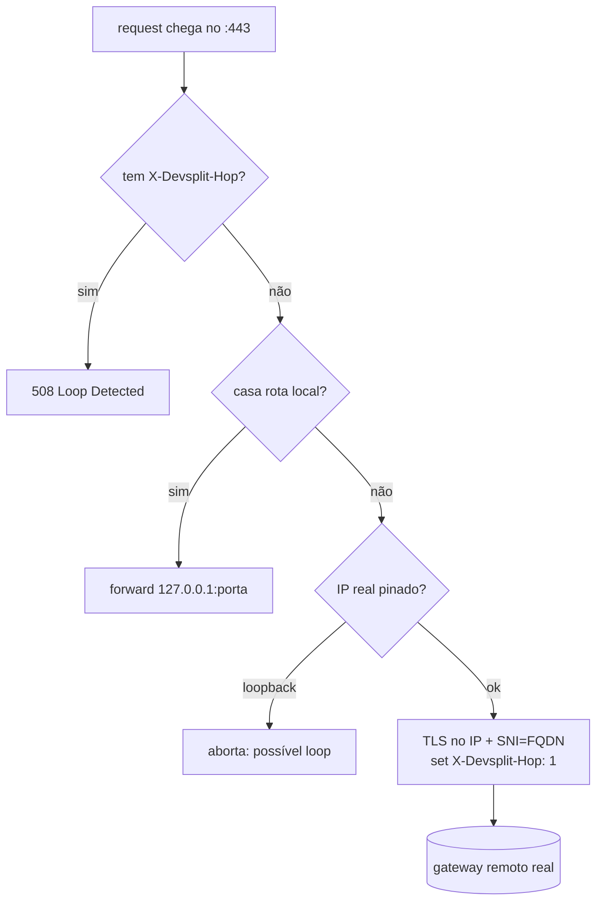

# 01 — O problema e os conceitos centrais

> O "porquê" e o "como funciona" antes do "onde está o código". Fixa as quatro
> invariantes, o split por path-prefix, o passthrough validado, o anti-loop, perfis e
> multi-host. É a **spec conceitual canônica**: `02`–`12` implementam o que está aqui.

---

## 1. O problema

Microsserviços demais para caber na RAM (e na paciência) do dev. Subir o stack inteiro
localmente — N serviços + RabbitMQ + Redis + observabilidade — só para mexer em **um**
serviço é desperdício. A economia certa é: **rodar local só o que você está mexendo** e
apontar **o resto** para um ambiente de stage já de pé.

A implementação de referência fazia isso com **Traefik + mkcert + `/etc/hosts` + scripts
bash** — funcional, mas "3 passos com sudo num script que só roda no seu Arch". O devsplit
**produtiza** essa costura: um app com UI, cross-platform, config commitável.

### 1.1 As quatro invariantes não-negociáveis

| # | Invariante | Por quê |
|---|---|---|
| 1 | **Transparência** | O front continua apontando para a URL de stage. Sem PAC, sem proxy de sistema, sem editar `.env`. É reverse-proxy **por domínio**, não forward-proxy de debug. |
| 2 | **Split por path-prefix com passthrough real** | Prefixo mais específico vence; o catch-all vai para o **remoto verdadeiro** (separa de ferramentas que só mapeiam domínio→porta local). |
| 3 | **Cert remoto validado no passthrough** | Conecta no IP real + `ServerName`=FQDN e valida o cert remoto. **Nunca** desabilita verificação. |
| 4 | **Mesmo ambiente (stage, nunca prod)** | O serviço local recebe o **mesmo** cookie/JWT, do mesmo issuer/banco. Por isso prod é recusado por design. |

---

## 2. Transparência: como o front "não percebe"

```
1. O front faz GET https://api.stage.acme.com/transporte/x
2. No PC do dev, /etc/hosts manda api.stage.acme.com -> 127.0.0.1
3. O devsplit, escutando em :443, TERMINA o TLS com um cert local CONFIÁVEL
   (mkcert instalou a CA local no trust store -> o navegador não reclama)
4. Agora o devsplit tem a request em claro e decide o destino (§3)
```

Dois pré-requisitos tornam isso invisível:

- **`/etc/hosts`** aponta o FQDN para loopback (gerido pelo devsplit — `12` §6).
- **Cert local confiável** — mkcert instala a CA local na trust store do SO e do NSS
  (navegadores). Sem isso, e com **HSTS** no stage, o browser nem deixa clicar em
  "prosseguir" (`11` §2).

---

## 3. Split por path-prefix

Cada requisição é roteada por **Host + prefixo de path**. A tabela de rotas
(`RouteTable`, em `types.rs`) é **pré-ordenada por especificidade** (prefixo mais longo
primeiro), então o **primeiro match vence** e é o mais específico.

```
Host = api.stage.acme.com,  path = /transporte/pedidos/42
  rotas locais (ordenadas):
    /transporte  -> http://127.0.0.1:3000   ← casa (prefixo mais longo que '/')
    /auth        -> http://127.0.0.1:3001
  decisão: LOCAL 127.0.0.1:3000
```

- **Match local** → encaminha para `127.0.0.1:porta` em **HTTP/1.1 claro**
  (`Decision::Local("127.0.0.1:3000")`).
- **Nenhum match** → **passthrough** (`Decision::Passthrough`) para o gateway remoto.

A diretiva `also` no `devsplit.yaml` adiciona prefixos extras para o **mesmo** target —
o caso clássico é `/socket.io` junto do prefixo do app (`10` §4).

---

## 4. Passthrough validado + anti-loop

O catch-all é a parte sutil. O `/etc/hosts` faz o FQDN resolver para `127.0.0.1` para
**todo** processo — inclusive o próprio devsplit. Conectar pelo nome reentraria no proxy:
**loop**. As defesas (cinto **e** suspensório):

1. **DNS direto (anti-loop primário).** O IP **real** do gateway é descoberto via
   `hickory-resolver` com nameservers explícitos (Cloudflare `1.1.1.1` + Google
   `8.8.8.8`) e `use_hosts_file = false` — **ignora** o `/etc/hosts`. (`dns.rs`.)
2. **Pin de IP + SNI validado.** O passthrough conecta no **IP** (não no nome) e abre TLS
   com `ServerName` = FQDN, validando o cert remoto contra os roots da Mozilla
   (`webpki-roots`), **sem** `dangerous()`. O `Host` da request é reescrito para o FQDN.
3. **Recusa de loopback.** Se o IP resolvido for loopback, o passthrough **aborta** com
   erro (possível loop).
4. **Header `X-Devsplit-Hop`.** Toda request de passthrough sai marcada com
   `X-Devsplit-Hop: 1`. Se uma request **entrar** no proxy já com esse header, o devsplit
   responde **`508 Loop Detected`** imediatamente (sem reencaminhar).



O IP é resolvido pela casca Tauri **uma vez** ao ligar e re-resolvido a cada 60s (ou
manualmente) — ver `12` §8. O núcleo (`forward_passthrough`) **exige** o IP já pinado
(`PassthroughTarget.fixed_ip`); resolver é responsabilidade da casca.

---

## 5. WebSocket, cookies, CORS

- **WebSocket.** O upgrade (`Connection: Upgrade` + header `Upgrade`) é detectado; após o
  `101 Switching Protocols` o túnel vira **byte-copy bruto** (`copy_bidirectional`), tanto
  no local quanto no passthrough. Roteie **o prefixo do app e** `/socket.io` para o mesmo
  serviço local (via `also`).
- **Cookies.** O cookie de auth do gateway (`Domain=...stage...`, `Secure`, `SameSite`)
  vai ao **mesmo host** → chega ao passthrough **e** ao serviço local. **É o que faz
  funcionar:** o local recebe o mesmo token, do mesmo ambiente. Por isso **stage, nunca
  prod**.
- **CORS.** O motor responde o preflight `OPTIONS` na borda e espelha a `Origin` nos
  headers de resposta (`Access-Control-Allow-Origin` = origin pedida, com
  `Allow-Credentials: true` e `Vary: Origin`). Detalhe e a divergência com o
  `allow_origins`/`allow_origins_regex` do YAML em `02` §2.3 e `10` §6.

---

## 6. Perfis

Um **perfil** é um conjunto nomeado de rotas locais. Permite alternar "o que roda local"
sem editar rotas à mão:

- `default` — só o microsserviço que você mais mexe (ex.: `/transporte`).
- `transporte-e-auth` — `extends: default` + `/auth`.
- `full-local` — `extends: transporte-e-auth` + `/financeiro`.

`extends` herda as rotas do perfil pai (resolvido recursivamente, com **detecção de
ciclo**). A UI lista os perfis com `default` primeiro e o resto em ordem alfabética. O
perfil ativo é trocável a quente. Schema em `10` §3.

---

## 7. Multi-host

Além do host primário, o devsplit intercepta **hosts adicionais** ao mesmo tempo
(`extra_upstreams` no YAML → `ProxyConfig.extra_hosts`). Cada host extra tem seu próprio
passthrough; hoje os extras são **passthrough-only** (sem rotas locais próprias). Útil
quando o front fala com mais de um subdomínio do stage (ex.: `api.stage`, `ws.stage`,
`cdn.stage`). Todos os FQDNs (primário + extras) entram no SAN do cert local e no
`/etc/hosts`. Ver `10` §2 e `02` §2.

---

## 8. Hot-reload

A config runtime vive num `ArcSwap<ProxyConfig>`: trocar rotas/perfil/IP **substitui o
ponteiro atomicamente** — conexões em voo seguem com o snapshot antigo, novas pegam o
novo. Ligar/desligar uma rota, trocar de perfil ou re-resolver o IP **não derruba**
conexões. O `devsplit.yaml` também é observado em disco (polling de 2s): salvar o arquivo
ou um `git pull` recarrega a config e emite um aviso na UI (`12` §7).
